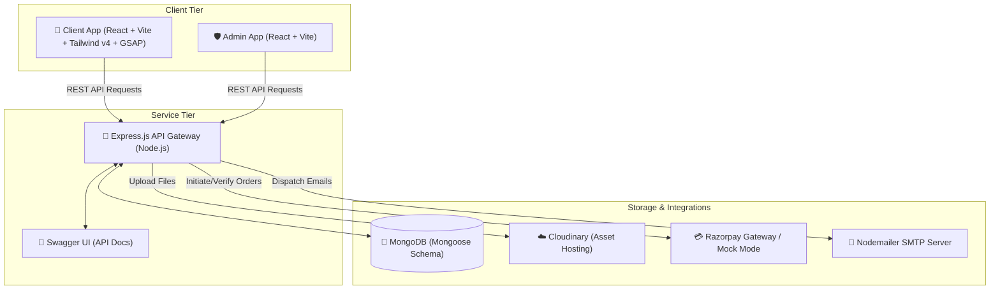

# 📱 OneQR — Dynamic NFC & QR Profile Orchestration Platform

OneQR is an enterprise-grade, full-stack digital identity platform that seamlessly bridges physical interactions (NFC tags, QR code standees) with dynamic, high-fidelity digital business profiles. Built using the MERN stack, OneQR provides an end-to-end ecosystem for local businesses, professionals, and teams to build brand presence, share contact cards, showcase catalogs, collect customer feedback, and analyze engagement in real-time.

---

<p align="center">
  
  
  
  
  
  
</p>

---

## 📖 Table of Contents
1. [📂 Project Structure](#-project-structure)
2. [🚀 Core Application Pillars](#-core-application-pillars)
3. [🛠️ Tech Stack & Integration Matrix](#%EF%B8%8F-tech-stack--integration-matrix)
4. [📐 System Architecture](#-system-architecture)
5. [📊 Data Modeling & Schemas](#-data-modeling--schemas)
6. [📡 RESTful API Documentation](#-restful-api-documentation)
7. [⚙️ Environment Configuration Matrix](#%EF%B8%8F-environment-configuration-matrix)
8. [🚀 Setup & Local Execution Guide](#-setup--local-execution-guide)
9. [💳 Payment Gateway Behavior](#-payment-gateway-behavior)
10. [📝 License](#-license)

---

## 📂 Project Structure

The project is structured as a monorepo containing three primary decoupled workspaces:

```
OneQR/
├── client/         # React-based Customer & Merchant frontend application
├── admin/          # React-based Admin Console interface
├── server/         # Express.js REST API and routing engine
└── assets/         # Shared assets and templates
```

---

## 🚀 Core Application Pillars

### 1. 👤 Customer-Facing Digital Profiles
- **Dynamic Mobile-First Rendering**: Fluid, responsive profile layout styled with Framer Motion, GSAP, and Tailwind v4.
- **Branding Customization**: Control over logos, backgrounds, card styles, and theme colors (e.g. gradient headers).
- **Interactive Actions**: Direct click-to-call, click-to-email, dynamic address links (Google Maps), and vCard generation.
- **Digital Menus & Catalogs**: Embedded rendering and download of PDF catalogs, price sheets, and portfolios (powered by Cloudinary).
- **Embedded Payment Interfaces**: Integrated UPI IDs and Bank Transfer details for direct consumer-to-business transactions.
- **Social Media Linkage**: Custom ordered arrays linking all active social channels (WhatsApp, Instagram, LinkedIn, YouTube, Facebook, X).
- **Feedback Collection**: Seamless form for customers to input ratings (1-5 stars) and reviews directly from their mobile devices.

### 2. 💼 Merchant Dashboard
- **Unified Analytics**: Real-time logging and display of total profile views vs. unique QR scans.
- **Standee & NFC Claim Flow**: Quick camera-based QR code scanner (`html5-qrcode`) or ID input to link a physical standee with a profile slot.
- **Dynamic Routing Control**: Instant routing switches connecting a physical standee/QR ID to a custom business slug.
- **Profile Customizer**: Interactive settings panel to modify and update contact coordinates, catalogs, and branding.
- **Customer Feedback Manager**: Section to review all incoming ratings, filter responses, and select testimonials to showcase publicly.
- **Subscription Management**: Subscription details view, tiered plans page, and active upgrade flow utilizing the Razorpay Checkout gateway.

### 3. 🛡️ Admin Console
- **Platform Analytics**: Dashboard metrics displaying total users, active profiles, and active QR codes.
- **QR Fleet Management**: 
  - Batch generation tool to generate unique serial QR codes.
  - Export system generating downloadable `.zip` archives containing the QR graphics (`jszip` and canvas exporters).
  - Physical batch status tracking (`ordered`, `printed`, `shipped`, `delivered`).
- **Workspace Control**: Capability to manually assign, unlink, or override merchant plans, subscriptions, and standee mappings.
- **User Administration**: Create accounts, manage plans, and lookup profiles associated with any user.

---

## 🛠️ Tech Stack & Integration Matrix

| Layer | Component / Tool | Technology / Library | Purpose |
| :--- | :--- | :--- | :--- |
| **Frontend** | Build Tooling | Vite | Fast bundle compilation and HMR |
| | UI Framework | React 19 | Declarative stateful component rendering |
| | CSS Framework | Tailwind CSS v4.0 | Utility-first layout styling and theme variables |
| | Animation Engines | GSAP & Framer Motion | Fluid entrance animations and micro-interactions |
| | Smooth Scrolling | Lenis | Hardware-accelerated viewport scrolling |
| | Camera Scanner | html5-qrcode | Integrated merchant-side QR scanning |
| | Export Tools | html2canvas-pro & JSZip | High-resolution QR rendering and admin batch downloads |
| **Backend** | Platform | Node.js | Asynchronous JavaScript runtime environment |
| | API Framework | Express.js 5.x | RESTful API endpoint management and middleware orchestration |
| | Database Mapper| Mongoose | Schema-driven Object Data Modeling (ODM) for MongoDB |
| | Documentation | Swagger UI & JSDoc | Real-time interactive API specifications playground |
| **Integrations**| Payment Gateway | Razorpay | Subscription transactions (with developer Mock Mode) |
| | File Storage | Cloudinary | Digital asset hosting (PDF menus, logos, documents) |
| | Mail Dispatch | Nodemailer SMTP | Transmitting contact form inquiries |

---

## 📐 System Architecture

Below is the design detailing how physical scans and backend services communicate:



### QR Redirection Resolution Sequence:
1. A user scans a physical OneQR sticker/standee pointing to `https://oneqr.dtechcode.in/qr/:qrId`.
2. The Server intercepts the scan on the route `GET /qr/:qrId`.
3. The server increments `qrScanCount` in the `ONEQRS` collection.
4. The server performs a lookup for the linked merchant profile:
   - If found and the profile has a custom slug, the server issues a `302 Redirect` to `https://oneqr.dtechcode.in/:slug`.
   - If not found, it redirects to the default path for frontend error handling.
5. The Client loads the business card dynamically, querying the backend at `GET /api/public/profile/:slug` to display metrics and custom branding, incrementing `profileViewCount`.

---

## 📊 Data Modeling & Schemas

### 👤 User Schema (`User.js`)
- `phone` (String, Unique, Required): Primary merchant identifier for phone-based auth.
- `password` (String, Required): Salt-hashed using `bcryptjs` before storage.
- `email` (String, Sparse, Unique): Optional email identifier.
- `orderHistory` (Array): Detailed logs of payment transactions, plans, and dates.

### 📄 Profile Schema (`Profile.js`)
- `user` (ObjectId ref User): Link to the workspace owner.
- `plan` (`free`, `basic`, `premium`, `enterprise`): Tier configuration.
- `subscriptionStatus` (`active`, `inactive`): Billing status identifier.
- `qrId` (String): The physical Standy ID connected to the profile.
- `slug` (String, Indexed): Clean URL-friendly string derived from the company name.
- `profileLogo` / `qrColor` / `headerColor`: Branding style metadata.
- Contact/Business Details: Address, GST, Maps links, Timings, Bio, Phone, Email, Website.
- Payments: bankUpiId, bankName, bankAccountNo, bankIfsc, bankAccountName.
- `customLinks` (Array of objects): Dynamic merchant-defined external links.
- `profileDocuments` (Array of objects): File details and secure URLs pointing to Cloudinary.

### 🎟️ OneQr Schema (`OneQr.js`)
- `qrId` (String, Unique, Required): Unique serial ID of the physical standy.
- `assignedTo` (ObjectId ref User): The merchant workspace owner.
- `batchId` (ObjectId ref Batch): The printing batch run group.
- `plan` / `subscriptionStatus` / `subscriptionExpiresAt`: Linked billing rules.
- `qrScanCount` (Number): Dynamic scan counter updated on redirection.

---

## 📡 RESTful API Documentation

The REST API contains comprehensive interactive Swagger documentation. When running the server locally, navigate to `/api-docs` (e.g. `http://localhost:5000/api-docs`) to view schemas, request structures, and response objects.

### Core Endpoints Table

| Category | Method | Endpoint | Auth | Purpose |
| :--- | :--- | :--- | :--- | :--- |
| **Public** | `GET` | `/health` | None | Verify API Gateway operational status |
| | `POST` | `/contact` | None | Send contact inquiry emails |
| | `GET` | `/public/profile/:slug` | None | Retrieve custom profile branding and details |
| | `POST` | `/public/profile/:slug/feedback` | None | Submit customer rating and reviews |
| **Auth** | `POST` | `/auth/signup` | None | Create new merchant credentials |
| | `POST` | `/auth/login` | None | Log in to profile workspace (returns JWT) |
| | `GET` | `/auth/me` | Bearer | Retrieve details of current logged-in user |
| **Profile** | `GET` | `/profile` | Bearer | Retrieve profile workspace settings |
| | `PUT` | `/profile` | Bearer | Update profile text, layout, and contact card |
| | `POST` | `/profile/upload` | Bearer | Upload media assets (logos/PDFs) to Cloudinary |
| | `POST` | `/profile/qrs/claim` | Bearer | Allocate a physical QR Code to the active account |
| | `POST` | `/profile/connect-standy` | Bearer | Map an allocated QR ID to a profile slot |
| **Payment** | `POST` | `/payment/create-order`| Bearer | Initialize a Razorpay payment order |
| | `POST` | `/payment/verify-payment`| Bearer | Validate payment signature and update plan status |
| **Admin** | `GET` | `/admin/stats` | Admin | Get central user, QR, and plan metrics |
| | `POST` | `/admin/qrs/generate` | Admin | Generate a new batch run of QR codes |
| | `POST` | `/admin/profiles/:id/plan` | Admin | Adjust, downgrade, or extend subscriptions manually |

---

## ⚙️ Environment Configuration Matrix

Set up the following configuration variables inside your environments to orchestrate system keys:

### 🚀 Server Environment (`server/.env`)

```ini
# Server Infrastructure Config
PORT=5000
NODE_ENV=development
CORS_ORIGIN=http://localhost:5173,http://localhost:5174

# Database Setup
DB_URL=mongodb+srv://<username>:<password>@cluster.mongodb.net/oneqr

# Authentication
JWT_SECRET=your_super_secure_jwt_passphrase_key
JWT_EXPIRES_IN=7d

# Public Redirection URLs
QR_URL_PREFIX=http://localhost:5173

# Cloudinary Integration (Digital Assets)
CLOUDINARY_CLOUD_NAME=your_cloudinary_cloud_name
CLOUDINARY_API_KEY=your_cloudinary_api_key
CLOUDINARY_API_SECRET=your_cloudinary_api_secret

# Razorpay Integration (Subcriptions)
RAZORPAY_KEY_ID=your_razorpay_key_id
RAZORPAY_KEY_SECRET=your_razorpay_key_secret

# Nodemailer SMTP Configuration
EMAIL_USER=your_smtp_email@gmail.com
EMAIL_PASS=your_smtp_app_password
```

### 💻 Client / Admin Environment

Create `.env` file within the `client` and `admin` directory root levels:

```ini
# Client and Admin Gateway
VITE_API_URL=http://localhost:5000/api
VITE_QR_URL_PREFIX=http://localhost:5173
```

---

## 🚀 Setup & Local Execution Guide

Follow these commands to deploy the entire stack locally for development:

### 1. Prerequisites
- **Node.js** >= v18.0.0
- **MongoDB Instance** (Local Community Edition or MongoDB Atlas Cluster)

### 2. Startup Server Backend
```bash
# Navigate to Server directory
cd server

# Install dependencies
npm install

# Run the development server (runs nodemon internally)
npm run dev
```
The server will boot up by default on port `5000` (http://localhost:5000) and API documentation will be active on http://localhost:5000/api-docs.

### 3. Startup Client Application
```bash
# Navigate to Client directory
cd client

# Install dependencies
npm install

# Run Vite dev server
npm run dev
```
The client app will launch by default on http://localhost:5173.

### 4. Startup Admin Dashboard
```bash
# Navigate to Admin directory
cd admin

# Install dependencies
npm install

# Run Vite dev server
npm run dev
```
Vite will detect port allocation and boot on http://localhost:5174 (or next available).

---

## 💳 Payment Gateway Behavior

To facilitate friction-free development, testing, and system verification:
- **Mock Mode Fallback**: If Razorpay keys (`RAZORPAY_KEY_ID` and `RAZORPAY_KEY_SECRET`) are missing or blank in the server `.env`, the system automatically shifts to a mock payment interface.
- **Verification Flow**: In mock mode, order initialization bypasses live Razorpay API checkouts, and payment verification automatically updates the user's database subscription profile status to `active` upon completing simulated flows.

---

## 📝 License

This project is licensed under the terms of the **ISC License**.
