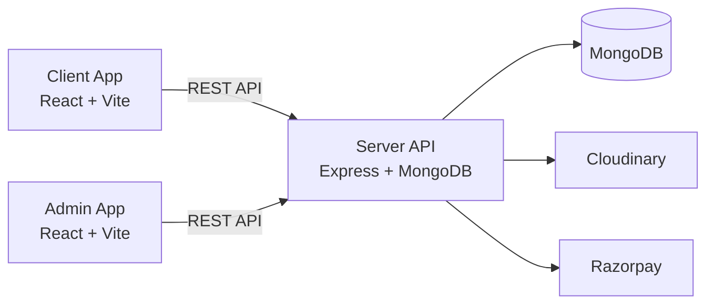

# OneQR

OneQR is a full-stack platform that turns a single QR or NFC tap into a rich digital business profile. It helps local businesses and teams share contact details, catalogs, offers, and feedback links while tracking scans and engagement from a unified dashboard.

## Product overview

OneQR combines three experiences:
- **Customer-facing digital profiles**: a mobile-friendly public page with links, documents, and branding.
- **Business dashboard**: manage profiles, QR assignments, scans, and feedback.
- **Admin console**: manage users, plans, QR inventory, and system stats.

## Key features

- Digital business profile with branding, links, social, and contact save
- Dynamic QR code links with scan tracking and profile views
- QR scan and claim flow for standees and printed codes
- Upload menus, catalogs, and documents (Cloudinary storage)
- Customer feedback collection and review suggestions
- Lifetime plan purchase flow (Razorpay + mock mode)
- Admin tooling for QR generation, assignment, and plan management

## How it works

1. User signs up with a phone number and creates a business profile.
2. User claims or scans a QR code to link it with a profile.
3. Customers scan the QR and land on a public profile page.
4. The dashboard tracks scans, views, and feedback.

## Admin console highlights

- View platform stats (users, profiles, QR counts)
- Create users and assign plans
- Generate, assign, or unlink QR codes
- Connect QR codes to profile slots

## Architecture



## Tech stack

- **Client**: React, Vite, Tailwind, Framer Motion
- **Admin**: React, Vite
- **Server**: Node.js, Express, MongoDB (Mongoose)
- **Payments**: Razorpay (with mock mode)
- **Uploads**: Cloudinary
- **QR scanning**: html5-qrcode

## Project structure

```
admin/   # Admin dashboard (React + Vite)
client/  # Customer-facing app (React + Vite)
server/  # API server (Express + MongoDB)
assets/  # Shared assets
```

## API overview

Base URL: `VITE_API_URL` (default `http://localhost:5000/api`)

Public:
- `POST /contact` - Contact form
- `GET /public/profile/:slug` - Public profile
- `POST /public/profile/:slug/feedback` - Submit feedback
- `GET /public/profile/:slug/review-suggestions` - Review suggestions
- `GET /health` - Health check

Auth:
- `POST /auth/signup`
- `POST /auth/login`
- `GET /auth/me`
- `PUT /auth/profile`

Profile:
- `GET /profile`
- `GET /profile/all`
- `PUT /profile`
- `POST /profile/upload`
- `POST /profile/delete-file`
- `GET /profile/qrs`
- `POST /profile/qrs/claim`
- `POST /profile/qrs/scan`
- `POST /profile/connect-standy`
- `GET /profile/feedbacks`

Payments:
- `POST /payment/create-order`
- `POST /payment/verify-payment`

Admin:
- `POST /admin/auth/login`
- `GET /admin/auth/me`
- `GET /admin/stats`
- `GET /admin/users`
- `POST /admin/users`
- `POST /admin/users/assign-plan`
- `GET /admin/users/:userId/profiles`
- `GET /admin/qrs`
- `POST /admin/qrs/generate`
- `POST /admin/qrs/assign`
- `POST /admin/qrs/assign-plan`
- `POST /admin/profiles/connect-qr`
- `POST /admin/profiles/:profileId/plan`
- `POST /admin/profiles/:profileId/unlink`
- `DELETE /admin/qrs/:id`
- `DELETE /admin/qrs`
- `DELETE /admin/profiles/:profileId`

Other:
- `GET /qr/:qrId` - QR redirect to the connected profile

## Environment variables

### Server (server/.env)

Required:
- `PORT`
- `DB_URL`
- `JWT_SECRET`
- `CORS_ORIGIN` (comma-separated list)
- `QR_URL_PREFIX` (used for QR redirects and profile URLs)

Optional / integrations:
- `JWT_EXPIRES_IN`
- `CLOUDINARY_CLOUD_NAME`
- `CLOUDINARY_API_KEY`
- `CLOUDINARY_API_SECRET`
- `RAZORPAY_KEY_ID`
- `RAZORPAY_KEY_SECRET`
- `EMAIL_USER` (for contact form email)
- `EMAIL_PASS` (for contact form email)

### Client and Admin

- `VITE_API_URL` (API base URL)
- `VITE_QR_URL_PREFIX` (public QR prefix, optional)

## Local development

### 1) Server

```bash
cd server
npm install
npm run dev
```

### 2) Client

```bash
cd client
npm install
npm run dev
```

### 3) Admin

```bash
cd admin
npm install
npm run dev
```

Default ports:
- Client: Vite default (5173)
- Admin: Vite default (5173 if run alone; adjust if both run)
- Server: `PORT` (commonly 5000)

## Payment behavior

If Razorpay keys are not configured, the server falls back to mock order and payment verification. This is useful for local development and demos.

## Notes and customization

- Contact form recipients are defined in the server contact controller. Update to your support inbox.
- Admin accounts are stored in the Admin collection and must exist before login.
- The QR redirect flow uses `QR_URL_PREFIX` and `/qr/:qrId` for public sharing.

## License

ISC
